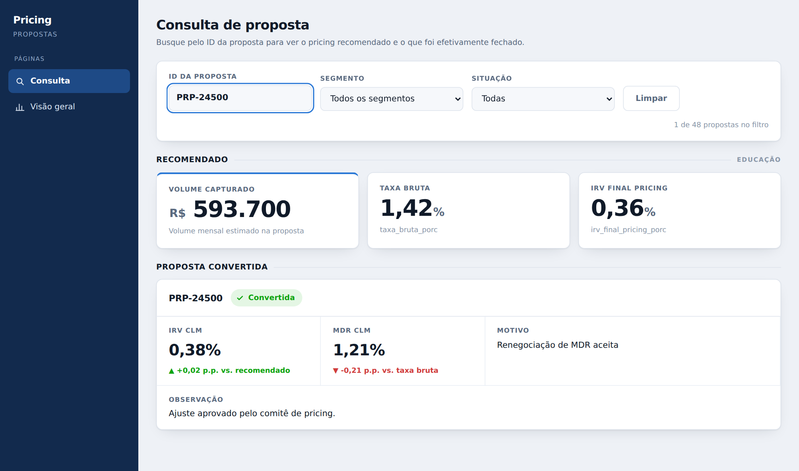
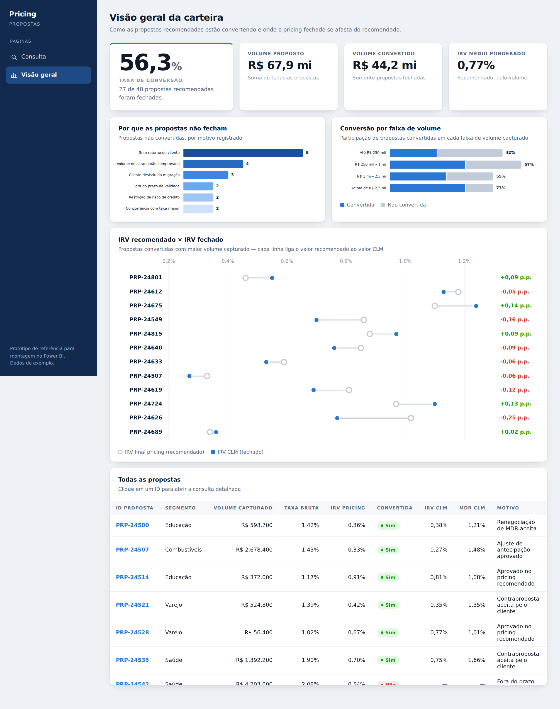

# Dashboard de Consulta de Propostas

Dashboard de duas páginas para o Power BI: busca de uma proposta pelo `ID_proposta` com o pricing **recomendado**, o que foi efetivamente **convertido**, e uma segunda aba com a leitura da carteira inteira.

## Arquivos

| Arquivo | O que é |
|---|---|
| **[`GUIA-POWER-BI.md`](GUIA-POWER-BI.md)** | Passo a passo da montagem: modelo, visuais, posições e cuidados. **Comece por aqui.** |
| `medidas.dax` | Todas as medidas DAX, comentadas e prontas para colar |
| `tema-powerbi.json` | Tema do relatório (*Exibição → Temas → Procurar temas*) |
| `dados_exemplo.csv` | 48 propostas fictícias para montar e testar antes de plugar a base real |
| `index.html` | Protótipo navegável — abra no navegador para ver o resultado esperado |
| `preview-*.png` | Capturas das duas páginas |

## Página 1 — Consulta

Busca por `ID_proposta` num slicer com pesquisa e seleção única. Selecionado o ID:

- **Recomendado** — `volume_capturado`, `taxa_bruta_porc`, `irv_final_pricing_porc` em três cartões grandes.
- **Proposta convertida** — selo Convertida / Não convertida, mais `irv_clm`, `mdr_clm`, `motivo` e `observacao`, com o desvio em pontos percentuais de cada valor fechado contra o recomendado.

## Página 2 — Visão geral

Taxa de conversão como número-herói, volume proposto × convertido, IRV médio ponderado, motivos de perda, conversão por faixa de volume, comparação IRV recomendado × fechado e a tabela completa.

## Sobre o protótipo

`index.html` é HTML/CSS/JS puro, sem dependências — abre com duplo clique. Serve para (a) validar o layout antes de montar no Power BI e (b) mostrar a tela para quem vai usar. Os dados são os mesmos do `dados_exemplo.csv`.
